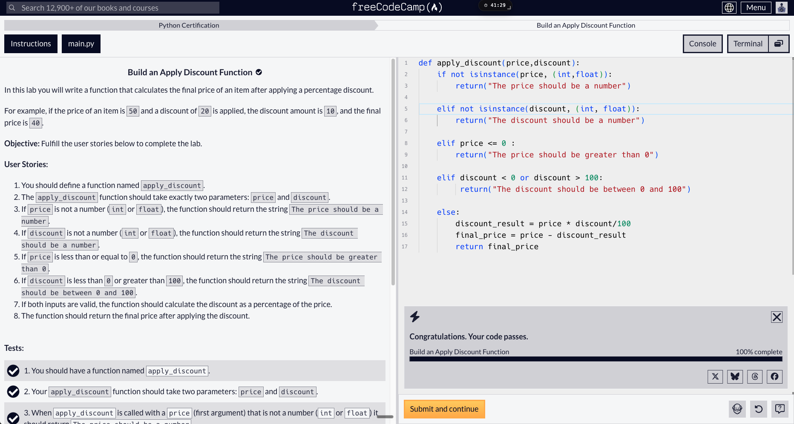

# Day 24: Build an Apply Discount Function (Lab)

Date: 2026-08-05
Topic: Functions & conditionals — validating inputs and calculating a percentage discount

## What I did
Completed the "Build an Apply Discount Function" lab (all 11 tests passing). Defined `apply_discount(price, discount)` with a chain of `if`/`elif`/`else` checks: validated that `price` and `discount` are numbers using `isinstance(x, (int, float))`, validated that price > 0 and discount is between 0 and 100, then calculated `discount_result = price * discount / 100` and returned `price - discount_result`.

## What clicked
Using `isinstance()` to check a value's type against multiple types at once (e.g. `isinstance(price, (int, float))`) — once the hint reminded me of it, it made sense as the right tool for "is this a number or not" checks.

## What was confusing
Two friction points: first, I initially reached for `!=` instead of `isinstance()` for the type check and had forgotten `isinstance()` existed — needed a hint to get there. Second, I blanked on how to actually calculate a percentage discount and had to check freeCodeCamp's help section to remember the math. Also noticed I need to get better at reading back through my own code to catch small mistakes.

## Tomorrow
Want to lean less on hints help and push through problems by thinking them out myself first, only asking for help when genuinely stuck. Next up per the roadmap: Build a Caesar Cipher (Workshop).

## Code



```python
def apply_discount(price,discount):
    if not isinstance(price, (int,float)):
        return("The price should be a number")

    elif not isinstance(discount, (int, float)):
        return("The discount should be a number")

    elif price <= 0 :
        return("The price should be greater than 0")

    elif discount < 0 or discount > 100:
        return("The discount should be between 0 and 100")

    else:
        discount_result = price * discount/100
        final_price = price - discount_result
        return final_price
```
