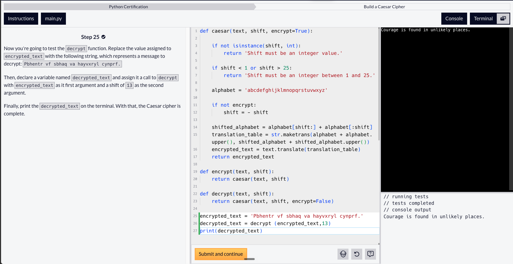

# Day 25: Build a Caesar Cipher (Workshop)

Date: 2026-08-06
Topic: Building a Caesar cipher (encrypt/decrypt functions)

## What I did
Worked through building a Caesar cipher, focusing on the deciphering (`decrypt`) function. Wrote the function from scratch, combining conditional logic with Python's built-in functions to shift and translate letters for encrypting and decrypting text.

## What clicked
Getting a complete function working end to end — conditional logic inside the function body, plus calling built-in functions to handle the character shifting/translation.

## What was confusing
A tough day overall — got stuck at a few points following the instructions, and wasn't reading back through the code carefully enough, which let typos through that blocked submission and threw errors. Took breaks along the way. Things didn't click as smoothly as usual, and the instructions were harder to follow than in previous lessons.

## Tomorrow
(not recorded)

## Code

