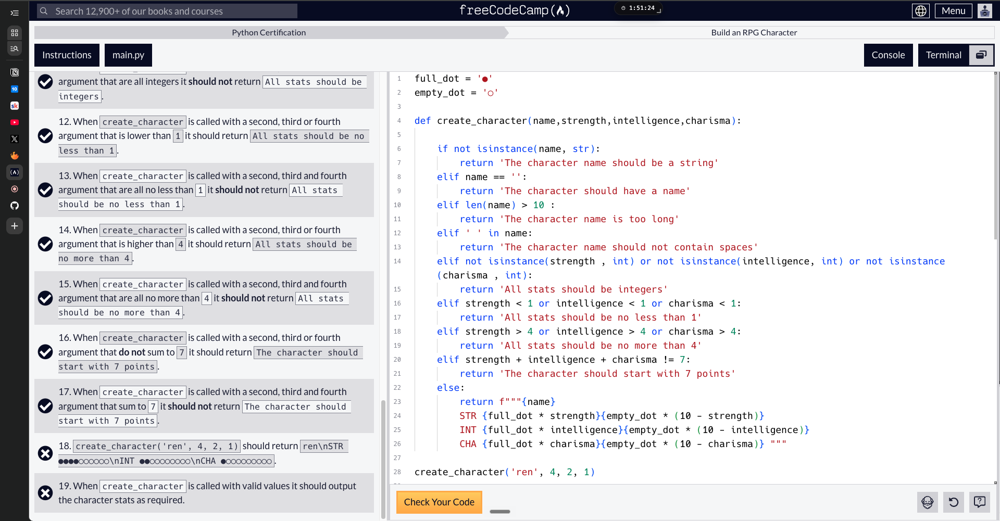
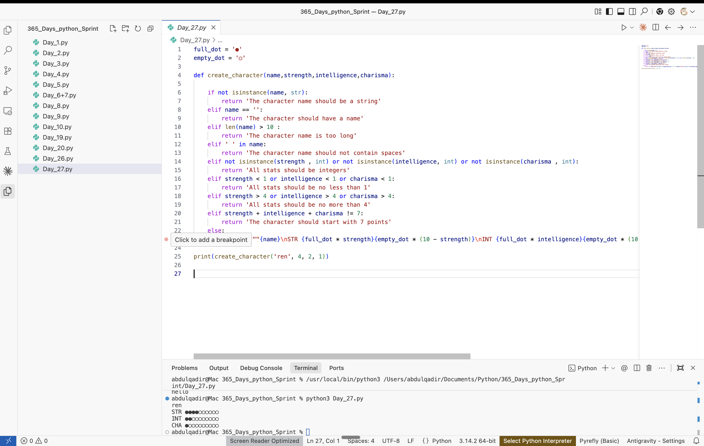

# Day 26: Build an RPG Character (Lab) + Python Basics Review & Quiz + Install Python (Theory + Review + Quiz)

Date: 2026-08-07 to 2026-08-09
Topic: Catch-up entry for the Fri Aug 7 - Sun Aug 9 roadmap items — RPG Character lab, Python Basics Review + Quiz, Install Python module

## What I did
Missed Friday, Saturday, and Sunday (Aug 7-9) — no Python work those days. Picked the "Build an RPG Character" lab back up on Aug 10, still short two user stories/conditions at that point. By Aug 12, finished the RPG Character lab, completed the Python Basics Review plus its quiz, and completed the Install Python module (theory + review + quiz) — closing out everything assigned for Aug 7-9.

## What clicked
Was able to recall things learned previously without leaning on AI to do it for me — worked through the RPG problem myself. Also found a new resource, Python Tutor, which walks through what the code is actually doing step by step. The Basics Review was a good chance to revisit strings, scope, and everything else covered so far in one pass.

## What was confusing
Project was tough overall ("whew") but no specific sticking point recorded beyond the two remaining user stories, which got resolved by Aug 12.

## Tomorrow
Move into the Loops and Sequences roadmap stretch (Aug 10-12 — still outstanding, see Day 27).

## Code

