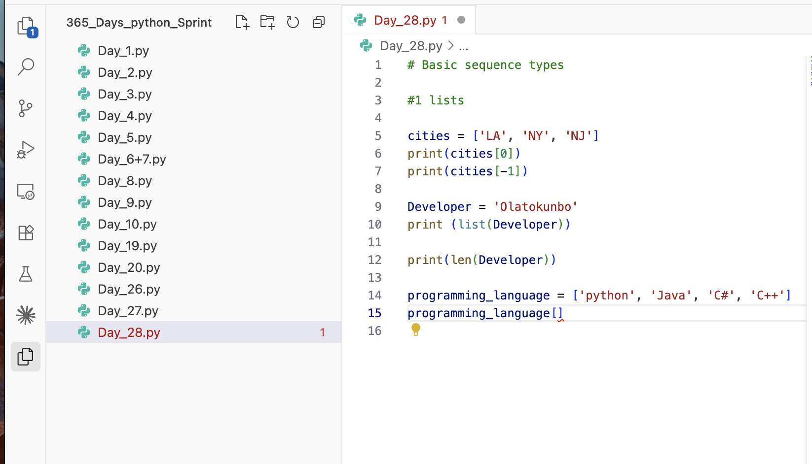

# Day 28: Working with Dictionaries and Sets (Theory) + Working with Modules (Theory)

Date: 2026-08-13
Topic: Lists - creating and modifying list sequences

## What I did
Started the next chapter — loops and sequences. Only had a couple minutes to study today (wished it could've been longer). Learned about the different types of sequences and worked with lists: how to create a list and how to change one.

## What clicked
(not recorded)

## What was confusing
(not recorded)

## Tomorrow
(not recorded)

## Code

