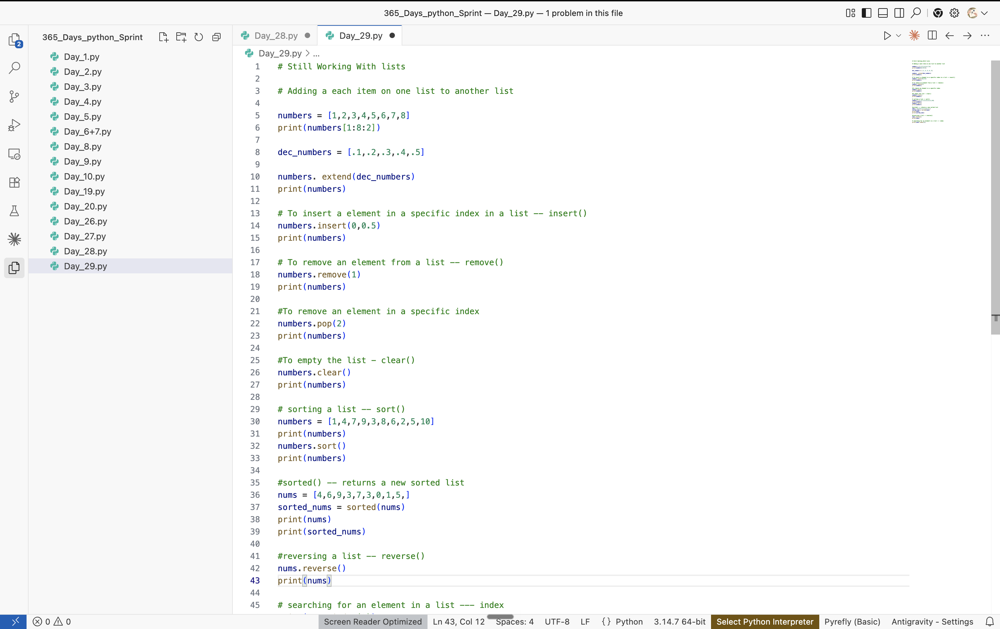

# Day 29: Working with Loops and Sequences (Theory)

Date: 2026-08-15
Topic: Python lists — construction, slicing, and built-in list methods

## What I did
Continued working through the "Working with Loops and Sequences" module, completing two sub-lessons: "What Are Lists and How Do They Work?" and "What Are Some Common Methods Used in Lists?" This picks up the Aug 10 backlog item on the roadmap.

Practiced list fundamentals and the core built-in list methods, including:
- List construction and extended slicing (`numbers[1:8:2]`) to pull every other element from a subrange
- `extend()` to merge the contents of one list into another in place
- `insert(index, value)` to add an element at a specific position
- `remove(value)` to delete the first matching element by value, vs. `pop(index)` to delete by position
- `clear()` to empty a list in place
- `sort()` to sort a list in place, vs. `sorted()` to return a new sorted list while leaving the original untouched
- `reverse()` to reverse a list's order in place
- Began exploring `index()` for locating the position of an element within a list

## What clicked
(not recorded)

## What was confusing
(not recorded)

## Tomorrow
(not recorded)

## Code

