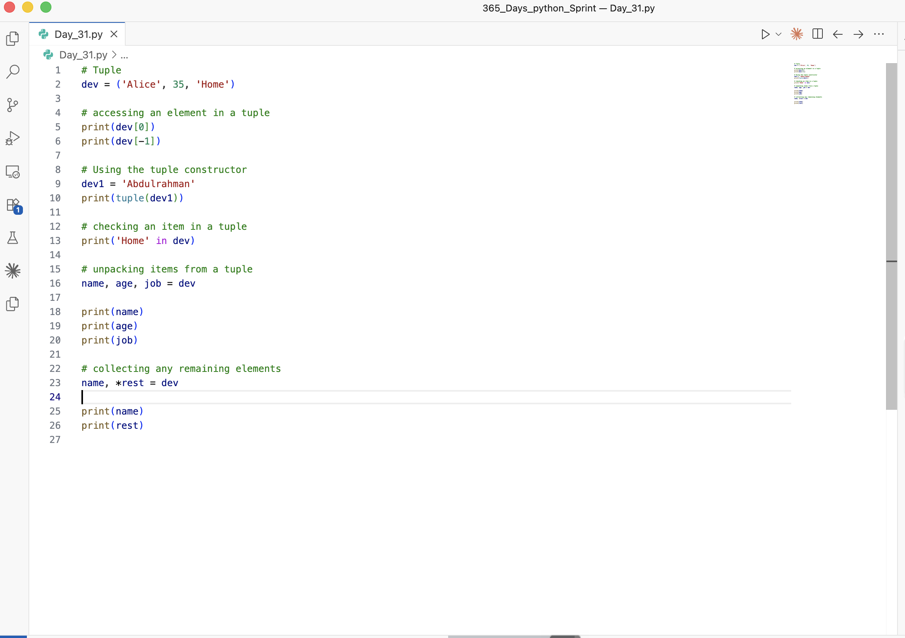

# Day 30: Working with Loops and Sequences (Theory)

Date: 2026-08-17
Topic: Tuples — creation, immutability, indexing, and unpacking (still working through Loops & Sequences)

## What I did
Worked through Python tuples: how to create a tuple, and confirmed that tuples are immutable — trying to edit one raises a `TypeError`. Practiced accessing elements with bracket notation, including negative indexing to read from the end of a tuple. Also covered:
- Creating a tuple with the `tuple()` constructor
- Checking whether an item exists in a tuple using the `in` keyword
- Unpacking tuple items into variables (same idea as with lists)
- Collecting remaining elements during unpacking with the `*rest` syntax

Wrote and ran the practice code in `Day_31.py`.

## What clicked
(not recorded)

## What was confusing
(not recorded)

## Tomorrow
Catch up on the backlog when time allows — after work or on weekends. Progress has been slow lately but staying consistent, inshallah.

## Code

